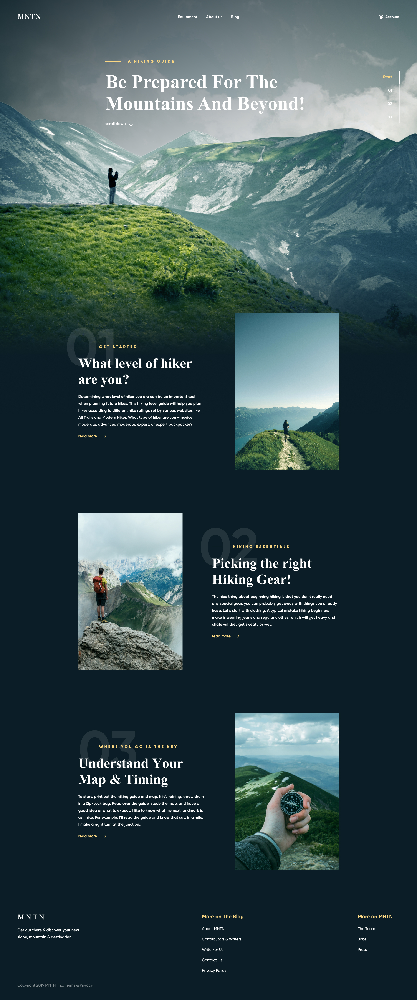

# шрифт підключений локально (у матеріалах до уроку є ще один конвертор)
# css написаний за бем
# фоновий малюнок для всього body + фоновий колір
# шапка сайту. меню- по центру, hover на ваш розсуд.
# scroll down разом із стрілкою – це якір до блоку 01
# блок навігації праворуч на першому екрані – це якірне меню до відповідного розділу. він зафіксований та завжди видимий на екрані. на пункті "start" показано hover.
# три блоки з текстом та картинкою – однакові структурно.
# весь текстовий блок щодо картинки знаходиться по центру
# «01» – абсолютно позиціонований текст
# "get started" - просто текст
# "read more" - разом з іконкою - це посилання, при ховері іконка стрілки від'їжджає вправо на 5 пікселів (поки без плавності)
# футтер. так само як шапка, у них своя максимальна ширина 1760px, а весь сайт 1200px.
# сайт гумовий, мінімальний розмір 991px

 